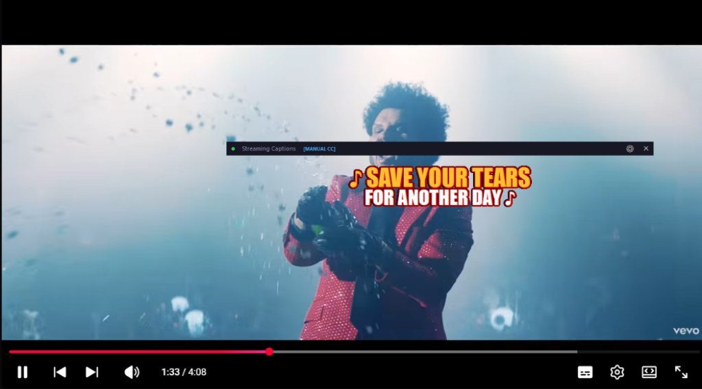

# YouTube Desktop Lyrics Overlay 🎵

A lightweight, local, and ad-free way to stream YouTube Closed-Captions directly to a beautiful, customizable, always-on-top transparent desktop overlay. Perfect for singing along to music videos or watching tutorials while working in other windows.

## 🚀 Features
- **Cinematic Styles**: Includes multiple typography styles like Cinematic Poster (Yellow & White split lines with red drop shadow) and Neon Glow.
- **Always On Top & Transparent**: The lyrics float seamlessly over your desktop wallpaper or other windows.
- **Zero Cloud**: Everything runs 100% locally on your machine via a WebSocket bridge.
- **Instant Customization**: Change font sizes and visual styles live from the Chrome Extension popup!

## 🛠️ Installation & Setup (For Users)

Because this tool connects your browser to your Windows desktop, it comes in two parts: a **Desktop App** and a **Chrome Extension**.

### Step 1: Start the Desktop App
**Easiest Method:** 
Simply double-click `run_overlay.bat` in the main folder. This will automatically install requirements and launch the overlay for you!

*(Alternative: You can also double-click `main_overlay.exe` if you downloaded the compiled version, or run `python main_overlay.py` from the `overlay_app` folder).*

A transparent window will appear at the top of your screen, and you will see a small green dot indicating the server is listening.

### Step 2: Install the Chrome Extension
1. Open Google Chrome and go to `chrome://extensions`.
2. Turn on **Developer mode** (the toggle switch in the top right corner).
3. Click the **Load unpacked** button in the top left.
4. Select the `extension` folder included in this download.

### Step 3: Connect the Bridge
1. Click the **Puzzle Icon** 🧩 in the top right of Chrome and pin the **YouTube Caption Overlay Bridge**.
2. Click the extension icon to open the sleek dark-mode popup.
3. Click **Connect Bridge**. 
   *(Note: The token is automatically saved and matched with your desktop app!)*

### Step 4: Play a Video!
1. Go to YouTube and play a video that has Closed Captions (CC).
2. The lyrics will instantly start streaming to your desktop!
3. Use the slider in the Chrome extension popup to dynamically change the size of the lyrics, or use the dropdown to change the visual style.

---

## ⚙️ Advanced Settings
If you want to lock the position of the overlay or make it "click-through" (so your mouse passes right through the text to the windows behind it), click the small **⚙ Gear Icon** in the top right corner of the transparent overlay on your desktop!
